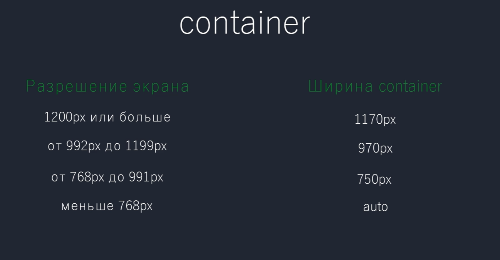
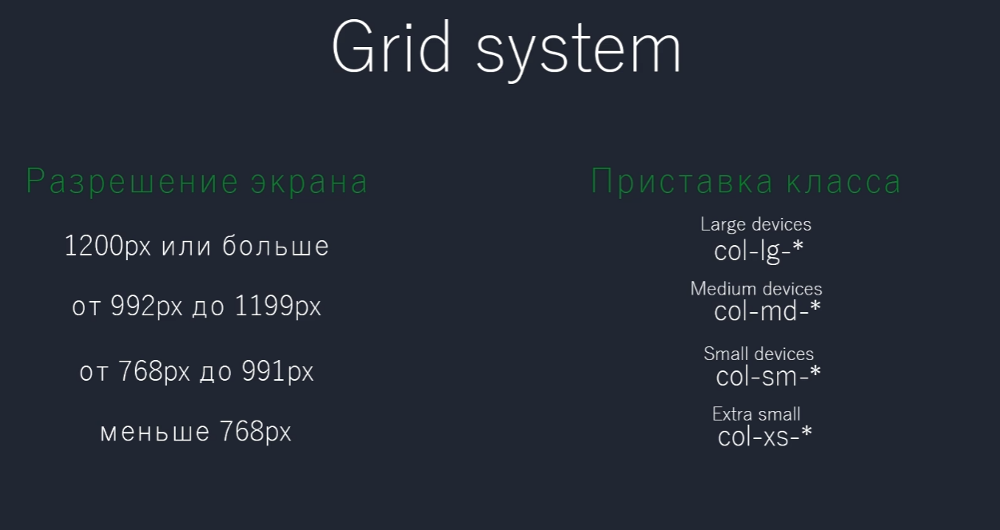

# FructCode: Курс Bootstrap 3



class `container-fluid` — растягивает <div> на всю длину страницы

class `container` — гибкий контейнер

class `row` — убирает отступы внутри контейнера

```css
.row {
    margin-right: -15px;
    margin-left: -15px;
}
```

class `col` — создает 12-ти колоночную сетку



class `hidden-` (-те же параметры, что и у `col`) — скрывать при определённых разрешениях

`push` — сдвиг вправо

`pull` — сдвиг влево

`nav-pills` — вертикальное меню
